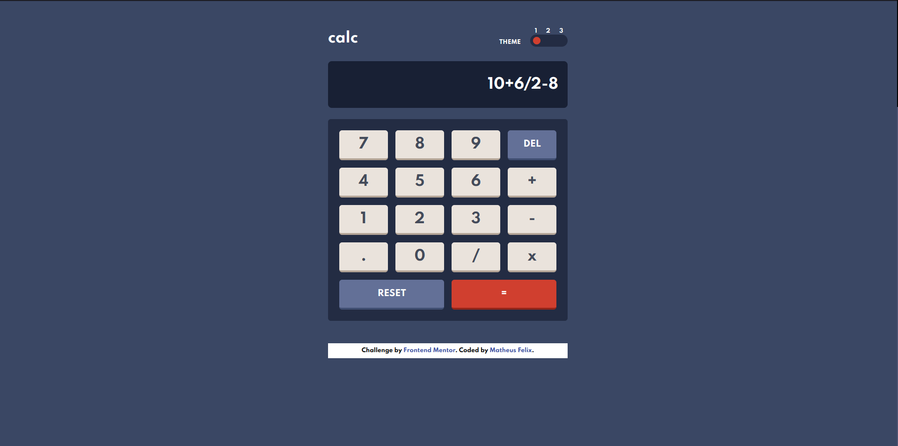

# Frontend Mentor - Calculator app solution

This is a solution to the [Calculator app challenge on Frontend Mentor](https://www.frontendmentor.io/challenges/calculator-app-9lteq5N29). Frontend Mentor challenges help you improve your coding skills by building realistic projects. 

## Table of contents

- [Overview](#overview)
  - [The challenge](#the-challenge)
  - [Screenshot](#screenshot)
  - [Links](#links)
  - [Built with](#built-with)
  - [What I learned](#what-i-learned)
- [Author](#author)

## Overview

  An excellent challenge from Frontend Mentor, where I could practice my Javascript skills and learn some concepts of working with arrays and DOM. In this challenge I used the Tailwind CSS framework to help me build a responsive layout and optimize my workflow. I also used NPM and JS to install tailwind and configure its dependencies.

### The challenge

Users should be able to:

- See the size of the elements adjust based on their device's screen size
- Perform mathmatical operations like addition, subtraction, multiplication, and division
- Adjust the color theme based on their preference
- **Bonus**: Have their initial theme preference checked using `prefers-color-scheme` and have any additional changes saved in the browser (Not done)

### Screenshot

### Links

- Solution URL: (https://github.com/MatheusFelixTI/Calculator-app)
- Live Site URL: (https://matheusfelixti.github.io/Calculator-app/)

### Built with

- HTML5
- CSS3
- Javascript 
- Tailwind CSS

### What I learned

  In this project I practiced DOM manipulation with Javascript and I was able to learn important array methods, which I believe that will be important in future challenges and projects. In the future I would like to be able to solve more complex problems that include DOM manipulation and working with arrays. This was my first Frontend Mentor challenge done and I hope it won't be the last.

## Author

- Website - [Matheus Felix](https://github.com/MatheusFelixTI)
- Frontend Mentor - [@yourusername](https://www.frontendmentor.io/profile/MatheusFelixTI)

